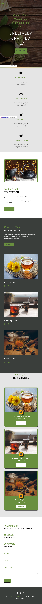
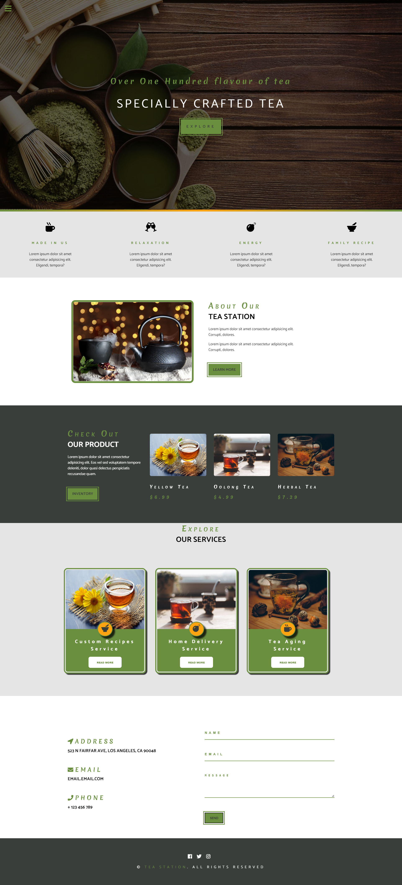

# Tea Station Project

## Table of contents

- [Overview](#overview)
  - [Screenshot](#screenshot)
  - [Links](#links)
- [My process](#my-process)
  - [Built with](#built-with)
  - [What I learned](#what-i-learned)
- [Author](#author)

## Overview

### Screenshot

### Links

- Live Site URL: [Link to live site](https://elaineleung.github.io/frontendmentor/blogrlandingpage/)

## My process

### Built with

- Semantic HTML5 markup
- CSS custom properties
- Float
- Mobile-first workflow

### What I learned

I think what I learned in this challenge is, a good UI design should make sense to the developer. I found myself questioning many of the design choices here, and the conclusion I came to was that, this was a challenge that's made to challenge the developer, namely when it comes to patience.

I wanted to Make a Project using Floats

## Author

- Frontend Mentor - [@z3shan7](https://www.frontendmentor.io/profile/z3shan7)

